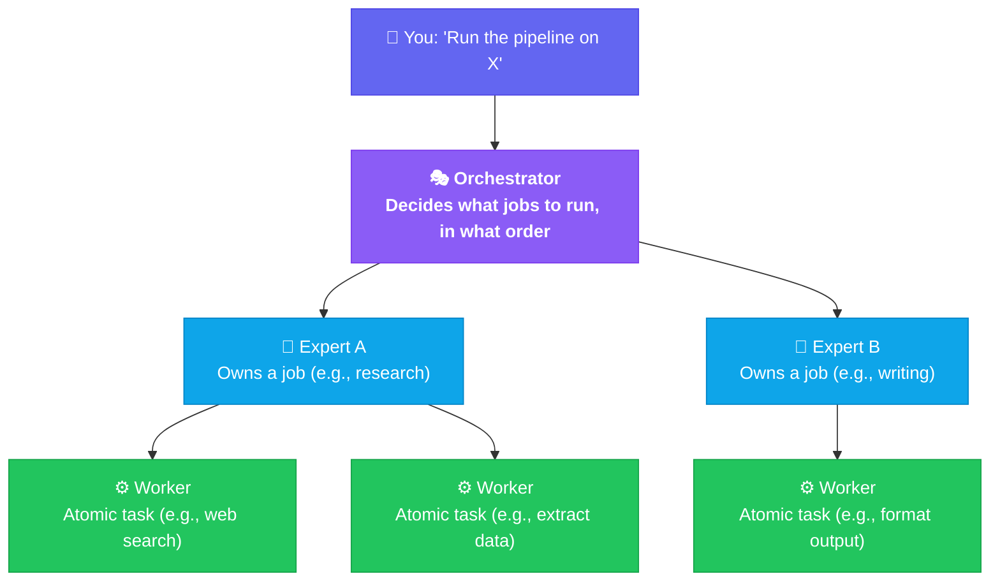
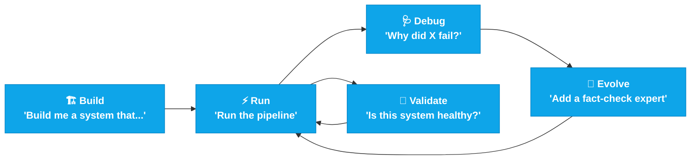
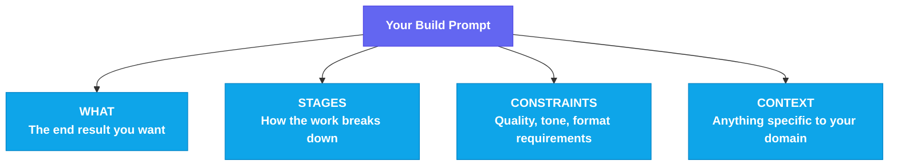
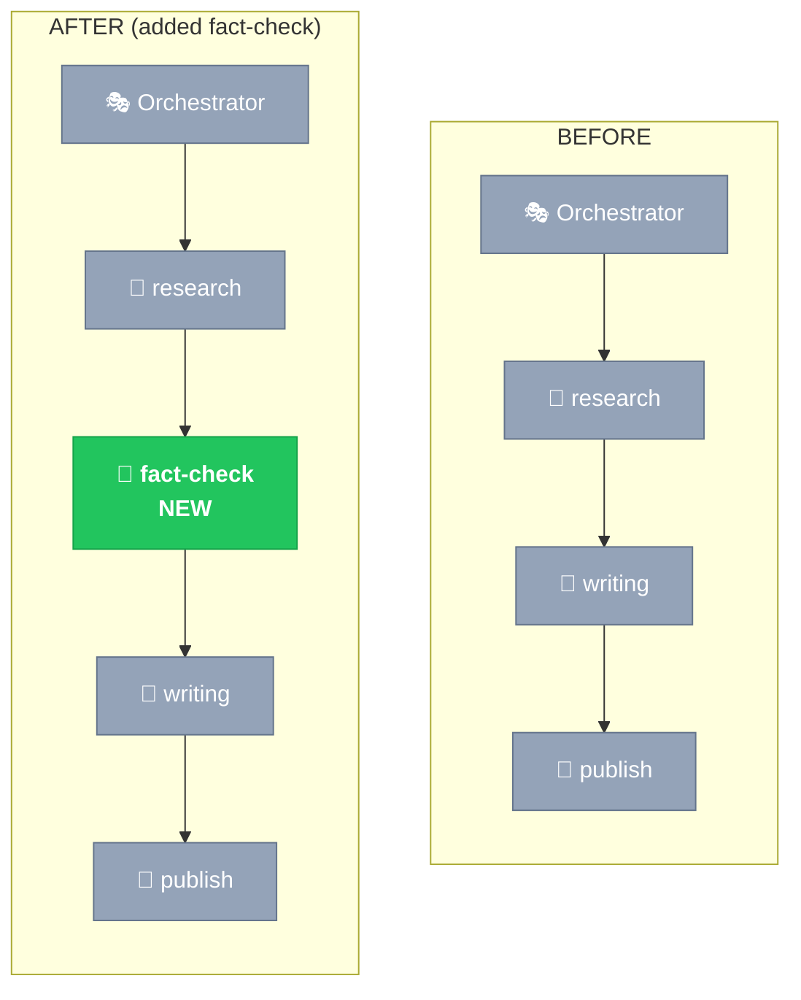

# 🪉ORPHEUS User Guide

**The complete guide to building, running, and evolving multi-skill AI systems with ORPHEUS.**

This guide is written for everyone whether you're a non-technical user automating a workflow for the first time, or an engineer integrating AI orchestration into a larger system. Read top-to-bottom for a complete tour, or jump to the section you need.

---

## Table of Contents

**Get started in 3 minutes:**
1. [What ORPHEUS Is, In Plain Language](#1-what-orpheus-is-in-plain-language)
2. [Installation](#2-installation)
3. [Your First System (3 Minutes)](#3-your-first-system-3-minutes)

**The mental model:**
4. [How ORPHEUS Thinks](#4-how-orpheus-thinks)
5. [When To Use ORPHEUS (And When Not To)](#5-when-to-use-orpheus-and-when-not-to)

**The most important section:**
6. [Writing Good Build Prompts](#6-writing-good-build-prompts) ⭐
7. [Using an Existing Design Doc](#7-using-an-existing-design-doc)

**Day-to-day use:**
8. [Running Your System](#8-running-your-system)
9. [When Things Go Wrong](#9-when-things-go-wrong)
10. [Evolving Your System Over Time](#10-evolving-your-system-over-time)

**Going deeper:**
11. [Provable Assurance: Trust Your System](#11-provable-assurance-trust-your-system)
12. [Reading Logs and Evidence Packages](#12-reading-logs-and-evidence-packages)

**Reference material:**
13. [Realistic Limits and Honest Caveats](#13-realistic-limits-and-honest-caveats)
14. [Worked Examples](#14-worked-examples)
15. [Frequently Asked Questions](#15-frequently-asked-questions)
16. [Glossary](#16-glossary)

---

## 1. What ORPHEUS Is, In Plain Language

ORPHEUS lets you build automated workflows by describing them in conversation, instead of writing code.

You say: *"Build me a system that researches a topic, writes an article, and saves it as markdown."*

ORPHEUS designs the workflow, generates all the necessary files, and gives you a working system you can run by saying *"Run the pipeline on quantum computing."*

**What gets generated isn't an "agent" or an "app."** It's a folder (`.orpheus/`) full of structured natural-language instructions that your coding agent (Claude Code) reads and follows. There's no Python to maintain, no servers to run, no APIs to wire up.

**Think of it like:** writing a recipe instead of building a restaurant. The recipe describes what to do; the kitchen (Claude Code) does it.

---

## 2. Installation

### What You Need

- **[Claude Code](https://docs.anthropic.com/en/docs/claude-code):** Anthropic's CLI for Claude. ORPHEUS runs through it.
- **A terminal:** macOS Terminal, iTerm, or your OS equivalent. Don't be intimidated; you'll only run a few commands once.
- **About 30 seconds** for the install itself.

### Install

Copy these commands one at a time into your terminal:

```bash
git clone https://github.com/nuryslyrt/ORPHEUS.git
```

```bash
cp -r ORPHEUS/skill/ ~/.claude/skills/orpheus/
```

```bash
chmod +x ~/.claude/skills/orpheus/scripts/*
```

That's it. No `pip`, no `npm`, no Docker, no API keys to configure beyond what Claude Code already uses.

### Verify

Open Claude Code, start a new session, and ask:

> "Is ORPHEUS available?"

Claude should confirm yes and offer to help you build something. If it doesn't recognize ORPHEUS, restart your Claude Code session, then skills are loaded at session start.

---

## 3. Your First System (3 Minutes)

Let's build something real. Pick a folder for your project:

```bash
mkdir ~/my-first-pipeline && cd ~/my-first-pipeline
```

Open Claude Code in that folder and type:

> *"Build me an ORPHEUS system that takes a URL, scrapes the page content, summarizes the key points in 5 bullet points, and saves the result as a markdown file."*

ORPHEUS will:
1. Analyze your description
2. Design the skill hierarchy (one orchestrator, 2-3 experts, a few workers)
3. Generate all the files
4. Validate that everything fits together
5. Show you what was built

When it's done, run it:

> *"Run the pipeline on https://example.com"*

That's the entire ORPHEUS user experience. **Two prompts. Working pipeline.**

---

## 4. How ORPHEUS Thinks

Understanding ORPHEUS's mental model helps you write better prompts and get better results.

### The Three-Level Hierarchy

Every ORPHEUS system has three kinds of skills working together:



- **Orchestrator** breaks your request into jobs and dispatches them
- **Experts** are domain specialists (one for research, one for writing, one for review, etc.)
- **Workers** do atomic tasks (a single web search, a single file format, a single check)

You don't usually think about workers directly. You describe what your *experts* should do, and ORPHEUS figures out the workers.

### The Lifecycle

Once you have a system, you interact with it through four operations:



| You say... | ORPHEUS calls... | What happens |
|---|---|---|
| "Build me a system that..." | **Builder** | Creates `.orpheus/` from scratch |
| "Run the pipeline..." | **Runner** | Executes the system inline |
| "Why did X fail?" / "Fix the tone" | **Doctor** | Diagnoses and applies fixes |
| "Validate my system" | **Auditor** | Health check + evidence package |
| "Add an expert for..." | **Surgeon** | Structural changes with cascading updates |

You never call experts by name. You just describe what you want; ORPHEUS routes to the right one.

---

## 5. When To Use ORPHEUS (And When Not To)

Honest guidance: ORPHEUS isn't right for every problem.

### ✅ ORPHEUS Is A Good Fit When

- **You have a multi-step workflow** with clear stages (research → analyze → write → review → publish)
- **Stages can be described in natural language** ("scrape this", "summarize that")
- **You want zero infrastructure** to deploy or maintain
- **You want to evolve the system** as requirements change
- **You're working with Claude Code** as your AI agent
- **The work is bounded** has a start, middle, and end (not a forever-running daemon)

### ❌ ORPHEUS Is NOT The Right Tool When

- **It's a single-step task**, use a regular skill, not a whole orchestrated system
- **You need real-time/streaming response**, ORPHEUS is batch-oriented
- **You need a long-running autonomous agent**, ORPHEUS executes within a session
- **You need GPT-4 or local models alongside Claude**, ORPHEUS uses Claude Code's runtime
- **You need millisecond latency**, ORPHEUS is for quality, not speed
- **You need to run on infrastructure that doesn't have Claude Code**, there's no standalone runtime

### ⚠️ ORPHEUS Has Honest Limits

- **Generated systems may need iteration.** First version is rarely the final version. Plan for refinement.
- **Cost scales with complexity.** A 10-expert system uses more LLM tokens per execution than a 3-expert one.
- **Prompt quality matters a lot.** A vague prompt produces a vague system. We'll cover this next.

---

## 6. Writing Good Build Prompts ⭐

This is the most important section in this guide. **The quality of your build prompt determines the quality of your system.**

### The Anatomy of a Good Build Prompt

A good build prompt covers four things:



### Side-By-Side: Bad vs. Good Prompts

**❌ Bad prompt:**
> "Make me a content thing."

**Why it fails:** ORPHEUS has no idea what content type, what stages, what quality bar. It will guess, probably wrong.

**✅ Good prompt:**
> "Build me a system that researches a technical topic, writes a 1500-word blog post in a conversational tone, fact-checks all claims, and outputs the result as markdown with proper citations. Target audience is intermediate developers."

**Why it works:** Stages are clear (research → write → fact-check → format). Quality is specified (1500 words, conversational, citations). Audience is named. ORPHEUS can design accordingly.

### A Prompt Template You Can Adapt

```
Build me an ORPHEUS system that:

[STAGE 1]: <what happens first, what's the input, what's the output>
[STAGE 2]: <what happens next, what depends on stage 1>
[STAGE 3]: <continue describing stages>
...

The final output should be: <what you want at the end>

Quality requirements:
- <tone, format, length, audience>
- <accuracy/correctness needs>
- <anything that must NOT happen>

Domain context (if applicable):
- <industry, target users, special vocabulary>
```

### Prompt Patterns That Work Well

**Pattern 1: Linear pipeline**

> *"Build me a system that takes a research paper PDF, extracts key findings, generates a one-page executive summary in plain language, and emails it to me."*

Stages: extract → summarize → email. Linear dependencies. Clear input and output.

**Pattern 2: Parallel research**

> *"Build a system that researches a company from multiple angles in parallel; financial health, competitive position, recent news, employee sentiment, then synthesizes everything into a single investment brief."*

Multiple parallel research jobs feeding one synthesis. ORPHEUS will use the same research-expert for parallel jobs.

**Pattern 3: Generate-and-validate**

> *"Build a system that generates Python unit tests for a given source file, runs them in a sandboxed environment, identifies which tests fail or have issues, and outputs a test quality report."*

Generation + validation pattern. The validator catches issues from the generator.

**Pattern 4: Multi-stage with quality gates**

> *"Build a system that drafts a customer support response, reviews it for tone and accuracy against our company style guide, and only outputs responses that pass review. If review fails, revise once and re-review."*

Quality gate with retry. ORPHEUS will model this as expert collaboration.

### Common Pitfalls In Build Prompts

**Pitfall 1: Specifying the implementation, not the goal**

❌ *"Build a system with a research-expert that has 3 web-search-workers and a writing-expert with 2 editing-workers..."*

✅ *"Build a system that does deep multi-source research and produces well-edited articles. Prioritize source diversity."*

**Why:** ORPHEUS is good at deciding skill structure. You're better at describing outcomes. Let it design.

**Pitfall 2: Asking for too much in one system**

❌ *"Build me a system that does research, writing, image generation, video editing, social media posting, email marketing, customer support, and accounting."*

✅ *"Build me a content publishing system that researches, writes, and publishes articles to my blog."* (then build a separate system for other concerns)

**Why:** ORPHEUS systems work best when focused. A system trying to do everything will do everything poorly.

**Pitfall 3: Ambiguous quality requirements**

❌ *"Make it good."*

✅ *"Articles should be 1000-1500 words, conversational tone, accessible to non-technical readers, with at least 3 cited sources, and never make claims about pricing or future events."*

**Why:** ORPHEUS encodes quality requirements into expert instructions. Specific requirements produce specific quality gates.

**Pitfall 4: Not mentioning what the system should NOT do**

❌ *"Build a coding assistant."*

✅ *"Build a coding assistant that explains code, suggests refactors, and generates tests. It should never modify production files directly, never make assumptions about the user's intent without asking, and never delete code without explicit confirmation."*

**Why:** Constraints are as important as capabilities. ORPHEUS encodes both.

### Quick Self-Check Before Submitting Your Build Prompt

Before pressing enter on a build prompt, ask yourself:

- [ ] Could a smart colleague build this if they only read my prompt? (No mind-reading required)
- [ ] Did I describe stages, not implementation?
- [ ] Did I name quality requirements explicitly?
- [ ] Did I mention the target audience or end user?
- [ ] Did I mention anything the system should NOT do?
- [ ] Is this scoped tightly enough that one system can do it well?

If you can answer yes to most of these, your prompt is ready.

---

## 7. Using an Existing Design Doc

If you already have a design document, technical spec, or workflow description, you can use it directly. ORPHEUS works very well with structured input.

### How to Provide a Design Doc

Three ways, in order of preference:

**Option A: Paste the doc inline**

> *"I have a design doc for a system I want to build. Here's the doc:*
>
> *[paste full text of your design doc]*
>
> *Build an ORPHEUS system that implements this design."*

ORPHEUS reads the doc, identifies stages, designs the skill hierarchy, and generates the system.

**Option B: Reference a file in your project**

> *"I have a design doc at ./design.md. Build an ORPHEUS system that implements what's described there."*

ORPHEUS reads the file directly. Good for longer docs that don't fit inline.

**Option C: Iterative refinement**

> *"I have a design doc at ./design.md. Read it carefully and ask me any clarifying questions before building. Once you have what you need, build the system."*

ORPHEUS will ask questions to fill gaps. Best for docs that aren't yet complete.

### What Makes a Good Design Doc for ORPHEUS

If you're writing a design doc specifically to feed ORPHEUS, structure it like this:

```markdown
# System Name

## Purpose
[One paragraph: what does this system do, who is it for?]

## Stages

### Stage 1: [name]
- Input: [what comes in]
- Output: [what goes out]
- Notes: [any special handling]

### Stage 2: [name]
[same structure]

[continue for each stage]

## Dependencies Between Stages
[diagram or list: which stages depend on which]

## Quality Requirements
- [bullet list of must-haves]

## Constraints
- [what the system must NOT do]
- [any specific tools/APIs to use or avoid]

## Sample Input → Sample Output
[concrete example showing what success looks like]
```

ORPHEUS can read less-structured docs too, but this format minimizes ambiguity.

### When NOT to Use a Design Doc

If you're prototyping or exploring, just describe your idea conversationally. Design docs are useful when:
- You've already thought through the problem carefully
- Multiple people need to agree on the spec before building
- You want a record of intent for future reference

For experimentation, a paragraph in chat is faster.

---

## 8. Running Your System

### The Basic Run

Once you have a `.orpheus/` directory in your project, you run by description:

> *"Run the pipeline on [your input]"*

For example:
> *"Run the pipeline on the article at https://nytimes.com/article-url"*

> *"Process the file at ./inbox/customer-feedback.csv"*

> *"Research quantum computing developments in 2026"*

ORPHEUS detects the `.orpheus/` directory, loads the orchestrator, and executes the workflow. You'll see progress as each stage completes.

### What You'll See During Execution

A typical run produces output like:

```
⚡ Execution e003 — content-pipeline

Phase 1: Decomposed into 4 jobs
Phase 2: Plan — 1 parallel batch + 3 sequential

Batch 1 (parallel):
  ├── [research-expert] ████████████████████ done (12s)

Batch 2:
  └── [writing-expert] ██████████████████████ done (18s)

Batch 3:
  └── [review-expert] ████████████ done (8s)

Batch 4:
  └── [publish-expert] █████████ done (6s)

✓ 4/4 jobs completed | 0 failures | 44s total
✓ Output: ./output/article-quantum-computing.md
```

### Where Outputs Go

By default, ORPHEUS writes outputs to `./output/` in your project directory. The exact location depends on what your system was built to do, file-based outputs go to disk, structured data goes to YAML/JSON, summary results appear in the conversation.

### State and Logs

Every execution is recorded:

```
.orpheus/
├── state/execution/{eid}/   # job inputs, intermediate results
└── logs/runtime/{eid}/      # decision trail, errors, timeline
```

You don't usually look at these directly, the Doctor and Auditor do. But they're there if you want to inspect.

---

## 9. When Things Go Wrong

ORPHEUS systems sometimes fail. Here's how to recover.

### Step 1: Read the Error

ORPHEUS preserves the full error chain, root cause to symptom. The output will show something like:

```
❌ Execution e004 failed at writing-expert

Error chain:
  orchestrator: Job 'write-article' failed after 2 retries
    ↳ writing-expert: Output didn't pass quality gate
      ↳ writing-expert: Article too short (got 350 words, expected 1000+)
```

The deepest level (the indented "↳") is usually what you need to fix.

### Step 2: Ask the Doctor

> *"Why did the writing step fail?"*

> *"Debug the last execution"*

> *"The article quality has been bad lately"*

The Doctor will:
1. Read the execution logs
2. Identify the root cause (vs. a symptom)
3. Categorize it as **behavioral** (instructions need refinement), **structural** (system architecture issue), **transient** (network/API blip), or **configuration** (settings problem)
4. Apply a fix directly if it's behavioral or configuration
5. Recommend the Surgeon if it's structural

### Step 3: Re-run and Verify

After a fix, run the pipeline again on the same or similar input. If the issue is resolved, you're done. If it's not, the Doctor will dig deeper on the next request.

### Common Failure Patterns

| Symptom | Likely Cause | Fix |
|---|---|---|
| One expert keeps producing bad output | Behavioral — its instructions need refinement | "Doctor: fix the [expert] tone/quality" |
| Job fails with "missing field" or "contract violation" | Structural — contracts don't line up | "Doctor: diagnose the contract issue" → likely escalates to Surgeon |
| Whole pipeline crashes on first job | Configuration — system.yaml or orchestrator routing broken | "Doctor: validate the system setup" |
| Random timeouts | Transient — external service issue | Retry; adjust `timeout_seconds` if recurring |

---

## 10. Evolving Your System Over Time

Real systems change. ORPHEUS makes evolution easy.

### Adding a New Capability

> *"Add a fact-checking expert between research and writing"*

The Surgeon will:
1. Analyze what's currently there
2. Plan all the cascading changes (new expert, updated routing, contract chain updates)
3. Show you the plan
4. Execute the changes after your approval
5. Validate the system still works

### Removing or Replacing Skills

> *"Remove the grammar-check worker. We're not using it anymore"*

> *"Replace the publish-expert with a multi-platform publisher that supports Medium and dev.to"*

The Surgeon handles cascading effects. If anything depends on what you're removing, you'll be warned.

### Restructuring Workflow

> *"Split the writing job into draft and polish stages"*

> *"Make research and competitive-analysis run in parallel instead of sequentially"*

These are structural changes the Surgeon handles end-to-end.

### What Evolution Looks Like Visually



The Surgeon shows this kind of before/after when you make structural changes.

---

## 11. Provable Assurance: Trust Your System

If you're building an ORPHEUS system that handles anything important; customer-facing content, financial decisions, security work you'll want to verify it's behaving correctly. The Auditor handles this.

### The Basic Audit

> *"Validate my system"*

> *"Run a health check"*

The Auditor produces:
- A **health score** (0.0 to 1.0)
- A status (`healthy` / `warnings` / `degraded` / `broken`)
- An **evidence package** — a YAML file documenting exactly what was checked and what passed
- Recommendations if anything needs attention

### What Gets Checked

By default, 7 structural claims:

| Claim | What it verifies |
|---|---|
| `artifact_integrity` | All skills referenced in the registry exist on disk |
| `tool_contract_soundness` | All contract chains are compatible |
| `workflow_termination` | The dependency graph terminates (no cycles) |
| `skill_definition_completeness` | All SKILL.md files have required sections |
| `routing_totality` | The orchestrator can route every expert |
| `observability_integrity` | Logs are well-structured |
| `configuration_validity` | system.yaml is well-formed |

### Adding Custom Claims

For domain-specific safety properties, edit `.orpheus/claims.yaml`:

```yaml
version: "1.0"
system: "your-system"
extends: [default]

claims:
  - id: writing_expert_never_publishes_unverified_facts
    statement: "The writing-expert never produces content with unverified factual claims"
    validation_method: policy-as-code
    evidence_source:
      - experts/writing-expert/SKILL.md
    renewal_trigger: "writing-expert SKILL.md modified"
    owner: doctor
    risk_tier: high
    tags: [accuracy, custom]
```

The Auditor will evaluate this every time it runs. The stub `claims.yaml` ORPHEUS generates includes a commented example you can adapt.

### Forward-Looking Assurance

If you want to track properties that aren't yet automatically validated (like runtime behavior or adversarial resistance), opt into the preview catalog:

```yaml
extends: [default, preview]
```

Preview claims appear in the evidence package as `unverified` with reasons. Useful for compliance teams that need visibility into what *isn't* yet validated.

### When to Use the Auditor

- **Before deploying changes** - make sure structural modifications didn't break anything
- **Before sharing a system with someone else** - get a clean evidence package
- **Periodically** - even healthy systems can drift if files change outside ORPHEUS
- **For compliance** - the evidence package is a machine-readable artifact suitable for approval workflows

---

## 12. Reading Logs and Evidence Packages

For when you want to dig into what actually happened.

### Log Locations

```
.orpheus/logs/
├── build/{build-id}/         # When systems are created/modified
└── runtime/{execution-id}/   # When systems are run
    ├── orchestrator/         # Orchestrator's decisions
    ├── jobs/{job-id}/        # Per-job execution detail
    ├── timeline.log.yaml     # Everything sorted by timestamp
    ├── decisions.log.yaml    # Just decision entries (the WHY trail)
    ├── errors.log.yaml       # Just errors and warnings
    └── execution.log.yaml    # Master summary
```

### What's in a Decision Log Entry

ORPHEUS doesn't just log what happened, it logs **why**:

```yaml
decision:
  question: "Should this job be delegated to workers or handled directly?"
  options_considered:
    - "direct execution"
    - "delegate to 2 parallel workers"
  chosen: "delegate to 2 parallel workers"
  reasoning: "Topic spans multiple sub-domains; parallel research covers
    more ground in less time."
  confidence: 0.88
```

When something goes wrong, this trail tells you whether the issue was bad reasoning (fix instructions) or bad inputs (fix data).

### Evidence Package Structure

After every Auditor run, look for `.orpheus/logs/build/{audit-id}/evidence-package.yaml`:

```yaml
audit_id: a012
system: content-pipeline
audited_at: 2026-04-30T10:12:03.000Z
overall_status: healthy
health_score: 1.0

claim_matrix_source:
  extends: [default]
  available_catalogs: [default, preview]
  has_system_override: true
  custom_claim_count: 0
  total_claim_count: 7

claims:
  - id: workflow_termination
    status: proven
    evidence:
      - type: dag_snapshot
        source: registry.yaml
        hash: sha256:3f2a...
    # ... more details
```

The evidence package is suitable for compliance review, deployment gates, or just personal record-keeping.

---

## 13. Realistic Limits and Honest Caveats

ORPHEUS is powerful but it's not magic. Here's what to expect honestly.

### What ORPHEUS Does Well

- **Workflow design** - given a clear description, ORPHEUS designs sensible skill hierarchies
- **Multi-step coordination** - running parallel and sequential jobs, handling failures, retrying transient errors
- **Natural language configuration** - the system is editable without coding
- **Iterative refinement** - the Doctor and Surgeon make evolution painless

### What ORPHEUS Struggles With

- **First-version perfection** - generated systems usually need 1-2 rounds of refinement
- **Highly creative tasks** - ORPHEUS is a coordinator; the experts within it are still LLMs and inherit LLM limitations
- **Real-time interactive systems** - ORPHEUS is batch-oriented; it doesn't support streaming chat-style interactions
- **Deterministic guarantees** - the LLM running the workflow can vary in output. Use claims and validation for properties you need guaranteed.

### Cost and Performance

- **Token usage scales with system complexity.** A 3-expert system might use 50K-200K tokens per execution. A 10-expert system can use much more.
- **Latency depends on parallelism.** Sequential pipelines run as fast as the longest chain. Parallel jobs run as fast as the slowest in each batch.
- **Quality depends on prompt quality.** Vague build prompts produce vague systems that produce vague outputs.

### When You'll Want to Look Elsewhere

| Need | Better tool |
|---|---|
| Single LLM call | A regular Claude Code skill, not ORPHEUS |
| Web app with real-time UI | A traditional framework (Next.js, etc.) |
| Background daemon running 24/7 | A serverless function or worker process |
| Mixing Claude with GPT-4 in the same pipeline | A custom orchestrator with both APIs |
| Strict latency SLAs (sub-second) | Direct API calls, not ORPHEUS |

---

## 14. Worked Examples

Real prompts that produced real systems.

### Example 1: Content Pipeline

**Prompt:**
> *"Build me an ORPHEUS system that researches a technical topic, writes a 1500-word blog post in a conversational tone with proper citations, fact-checks all claims, and outputs the result as a markdown file. Target audience is intermediate developers. The system should never publish content with unverified factual claims and should always cite at least 3 sources."*

**What ORPHEUS generated:**
```
content-pipeline/.orpheus/
├── orchestrator/SKILL.md       # "research → write → fact-check → format"
├── experts/
│   ├── research-expert/         # uses web-search-worker
│   ├── writing-expert/          # tone-aware, conversational
│   ├── fact-check-expert/       # validates claims against sources
│   └── format-expert/           # markdown with citations
└── workers/
    ├── web-search-worker/
    ├── citation-extractor-worker/
    └── markdown-formatter-worker/
```

**How to run:**
> *"Write a blog post about WebAssembly's role in edge computing"*

### Example 2: Code Review System

**Prompt:**
> *"Build me a system that reviews a pull request. It should: analyze the code changes for common bugs, check if tests cover the changes, identify potential security issues, and produce a structured review report. The reviewer should be thorough but not nitpicky — focus on real issues, not style preferences."*

**What ORPHEUS generated:** A 4-expert system with parallel analysis (bug-check, test-coverage, security-scan) feeding a synthesis expert that produces the final report.

**How to run:**
> *"Review the changes in ./pr-changes.diff"*

### Example 3: Customer Support Triage

**Prompt:**
> *"Build me a system that takes incoming customer support emails, classifies them by urgency and topic, drafts initial responses for the support team to review, and identifies any that should be escalated to engineering. Never auto-send responses — always require human review."*

**What ORPHEUS generated:** Classification expert + draft-response expert + escalation-detection expert. The final output is a structured handoff package, not auto-sent emails (per the constraint).

### Example 4: Research Synthesis

**Prompt:**
> *"Build me a system for synthesizing research on a topic. It should research from multiple angles in parallel (academic literature, industry reports, recent news, expert interviews if findable), then produce a comprehensive briefing document organized by key findings, controversies, and gaps in the field."*

**What ORPHEUS generated:** Parallel research jobs (4 different research-experts running simultaneously) feeding a synthesis-expert that produces the structured briefing.

---

## 15. Frequently Asked Questions

### General

**Q: Do I need to know how to code?**
A: No. ORPHEUS is designed to be used through conversation. The generated files are markdown and YAML, both human-readable. You can edit them by hand if you want, but you don't need to.

**Q: Can I share an ORPHEUS system with a colleague?**
A: Yes. The `.orpheus/` directory is portable. Send it (or commit it to git) and your colleague can run it from their machine. They need Claude Code installed.

**Q: Does ORPHEUS work offline?**
A: Mostly. The framework itself requires no network. But experts and workers that use web search or external APIs will need network access for those specific operations.

**Q: How much does ORPHEUS cost?**
A: ORPHEUS itself is free (AGPL v3 open source). You pay for Claude Code's underlying token usage when systems run. Costs scale with system complexity and execution frequency.

### Building Systems

**Q: My first system isn't quite right. What do I do?**
A: Two options. Either (a) ask the Surgeon to make changes — *"Add a step that does X"* — or (b) delete the `.orpheus/` directory and rebuild with a refined prompt. Option (a) is faster; option (b) is cleaner if you want to start fresh.

**Q: How do I know if my prompt is good enough?**
A: After ORPHEUS analyzes your prompt and proposes a system structure, look at the proposed structure before approving. If the experts and workers match what you intended, the prompt was good. If they don't, your prompt missed something, clarify and try again.

**Q: Can I have multiple ORPHEUS systems in different folders?**
A: Yes. Each project folder has its own `.orpheus/`. Switch between them by `cd`-ing.

### Running Systems

**Q: Can I run a system from a different folder?**
A: By default, no. ORPHEUS detects `.orpheus/` in your current directory. You can install a system as a standalone Claude Code skill (*"Install this system as a standalone skill"*), which lets you trigger it by name from anywhere.

**Q: How do I see what happened during an execution?**
A: Ask: *"Show me the timeline of the last execution"* or *"Why did Y happen?"*. ORPHEUS reads the logs and explains.

**Q: My system keeps producing bad output. Is it broken?**
A: Probably not broken, likely needs a behavioral fix. Ask the Doctor: *"The output quality is poor. Diagnose why."* The Doctor will identify whether it's instruction quality, input quality, or something structural.

### Provable Assurance

**Q: Do I need to use claims and evidence packages?**
A: No. They're optional. Many systems work fine without ever running the Auditor. But if you're building anything important, custom claims and periodic audits are valuable insurance.

**Q: What's the difference between "checked" and "proven" status?**
A: `proven` means mathematically guaranteed (only the DAG termination claim earns this). `checked` means a mechanical rule passed. `attested` means files exist and are well-formed. The Auditor never reports a stronger status than the validation method actually achieved.

**Q: Can I write claims for things ORPHEUS doesn't yet validate?**
A: Yes. Add them to `.orpheus/claims.yaml` with `validation_method: runtime` or `adversarial`. They'll show as `unverified` in evidence packages, which is honest. It tells reviewers what isn't yet automatically validated, while documenting your intent.

### Performance and Cost

**Q: How can I reduce token costs?**
A: Three ways: (1) Build smaller, more focused systems instead of one giant one. (2) Use cheaper models for simple workers when ORPHEUS asks about model preferences during builds, suggest Haiku for atomic tasks. (3) Avoid running the Auditor on every execution, run it before deployments and after structural changes, not constantly.

**Q: Can I make my system run faster?**
A: Mostly through parallelism. When you describe stages in your build prompt, mention which can run in parallel: *"Research, market analysis, and competitor scan should run in parallel. They're independent."*

---

## 16. Glossary

For non-technical readers, here's plain-language explanation of terms used throughout ORPHEUS.

| Term | Plain language |
|---|---|
| **Skill** | A markdown file that tells Claude Code how to do a specific job |
| **Orchestrator** | The skill that runs the whole show — decides what to do in what order |
| **Expert** | A skill specialized in a domain (research, writing, etc.) |
| **Worker** | A skill that does one atomic task (a single web search, a single file format) |
| **Pipeline** | The full multi-step workflow your ORPHEUS system represents |
| **Job** | One unit of work in the pipeline (e.g., "research the topic") |
| **Contract** | A list of inputs and outputs each skill expects/produces |
| **Registry** | The complete list of skills in your system |
| **Execution** | One run of your pipeline |
| **Build** | The act of creating a new ORPHEUS system |
| **Builder** | The expert that creates new systems (you trigger it with "Build me...") |
| **Doctor** | The expert that diagnoses and fixes issues (you trigger it with "Why did X fail?") |
| **Auditor** | The expert that validates system health (you trigger it with "Validate my system") |
| **Surgeon** | The expert that makes structural changes (you trigger it with "Add an expert for...") |
| **Runner** | The mode that executes your system (you trigger it with "Run the pipeline") |
| **Claim** | A specific safety property your system promises (e.g., "the workflow always terminates") |
| **Evidence package** | A file documenting what the Auditor checked and what passed |
| **Validation method** | How a claim is checked: `proof` (mathematically), `policy-as-code` (mechanical rules), `evidence` (file inspection) |
| **Renewal trigger** | What change would invalidate a claim and require re-checking |
| **Catalog** | A predefined set of claims (e.g., the `default` catalog has 7 standard claims) |
| **Self-contained** | Generated systems carry their own scripts and don't need ORPHEUS at runtime |

---

## You've Reached the End

By now you should be able to:

- ✅ Install ORPHEUS and verify it works
- ✅ Build your first system from a natural language prompt
- ✅ Write good build prompts that produce good systems
- ✅ Run, debug, validate, and evolve systems
- ✅ Use Provable Assurance for systems that need trust guarantees
- ✅ Read logs and evidence packages
- ✅ Understand realistic limits and when to use other tools

If something is still unclear, ask ORPHEUS itself: *"How do I do X with ORPHEUS?"* The framework can usually explain itself.

If you find a gap in this guide, an issue, or a use case it doesn't cover, please open an issue at [the GitHub repo](https://github.com/nuryslyrt/ORPHEUS) so the next reader has a better experience.

**Now go build something.**
